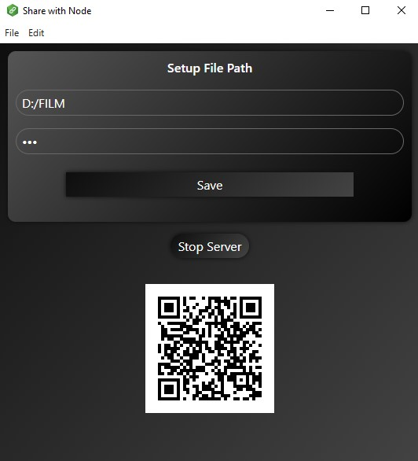
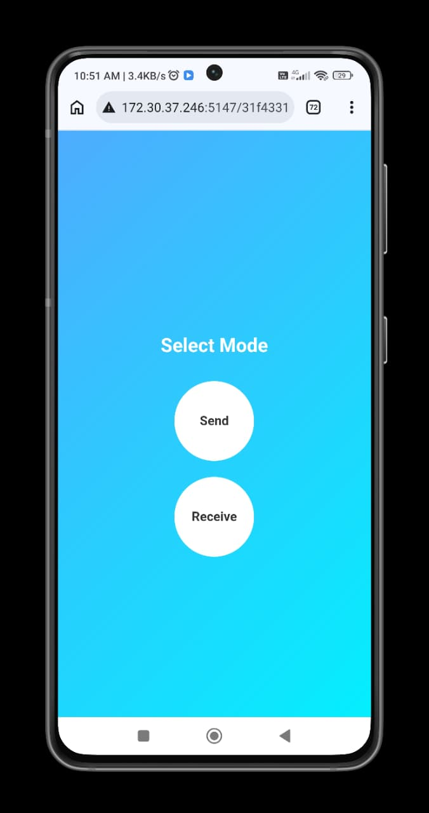
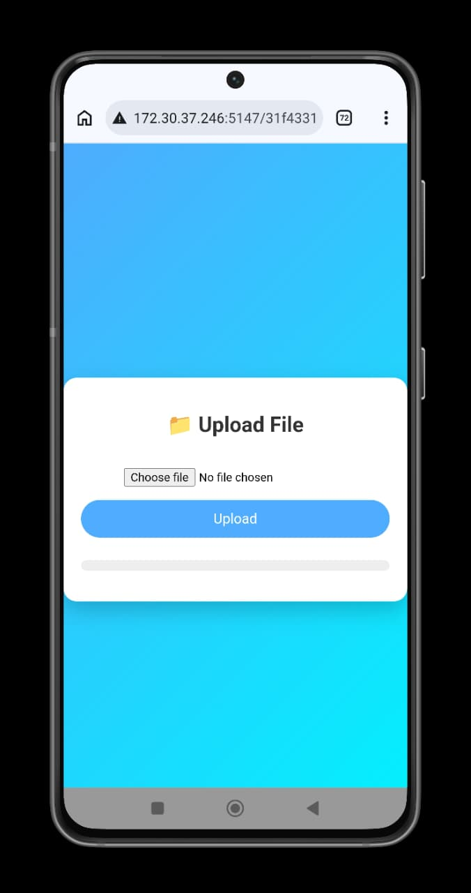
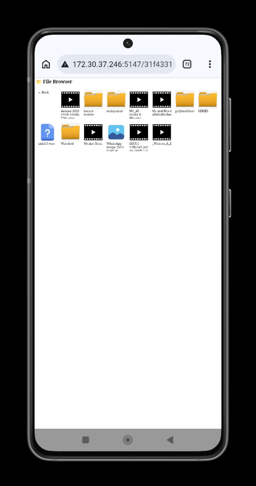

# Share With Node

A desktop application built with with Electron and Node.js that allows user to share files and Stream
videos over a local network using QR code-based connection

## Features

- 📡 Connect using QR code (no manual IP typing)
- 🔐 Secure login system
- 📁 File sharing over local network
- 🎬 Stream video directly in browser (no download required)
- ⚡ Fast and lightweight

## Tech Stack

- Electron
- Node.js
- Express.js
- Vite
- HTML, CSS, JavaScript

## Download

Download Latest Release

👉 [Click here for EXE file](https://github.com/Niyad-Labs/Share-With-Node/releases/download/v1.0.0/sharewithnodee-1.0.0.Setup.exe)

👉 [Click here for ZIP file](https://github.com/Niyad-Labs/Share-With-Node/releases/download/v1.0.0/sharewithnodee-1.0.0.Setup.zip)

⚠️ Note:
This app is not code-signed, so Windows may show a warning.

How to Run:

1. Extract the zip file
2. Open ShareWithNode.exe
3. If Windows shows warning:
   - Click "More info"
   - Click "Run anyway"

This app is safe and built using Electron.
And this is normal for indie developer apps.

## Screenshots

<div align="center">

</div>
<div style="display:flex;margin-top:10px; justify-content:space-around ">



</div>
---

## 📲 Usage

Explain how user uses app:

```md id="h7z3qp"
## Usage

1. Open the desktop app
2. Set path and password
3. Scan the QR code using your mobile
4. Enter password
5. Start sharing files or streaming videos
```

## Future Improvements

- text sharing
- track the sharing in desktop application
- better ui desgin

## Author

Muhammed Niyad
